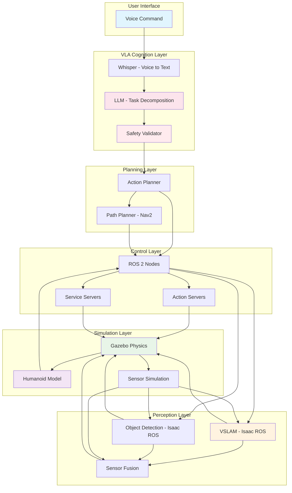

## Autonomous Humanoid System Architecture

This diagram illustrates the complete architecture of the autonomous humanoid system, showing the integration of all four layers of humanoid intelligence:

1. **VLA Cognition Layer**: Processes voice commands using Whisper and LLMs
2. **Planning Layer**: Decomposes tasks and plans navigation
3. **Control Layer**: ROS 2 middleware for robot control
4. **Perception Layer**: Isaac ROS for sensing and understanding
5. **Simulation Layer**: Gazebo for physics simulation

The system demonstrates the complete workflow from voice command to robotic action execution in simulation.